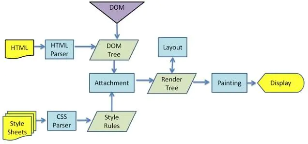
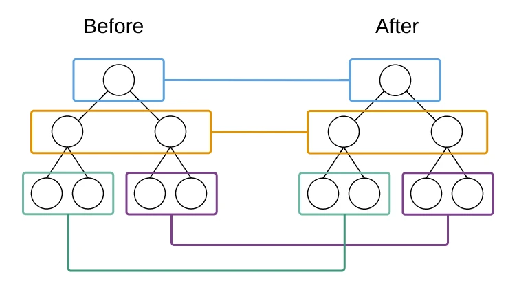
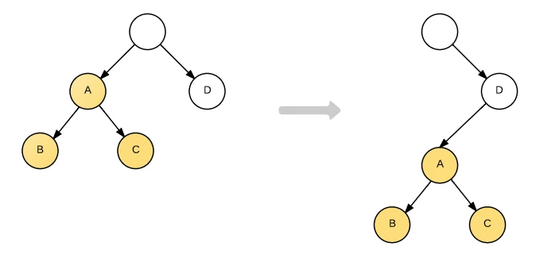
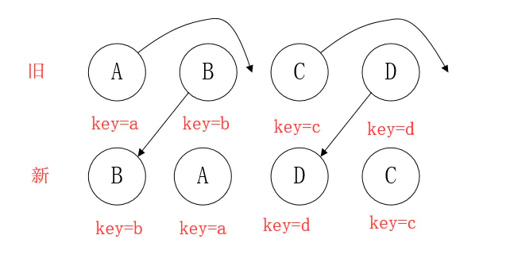
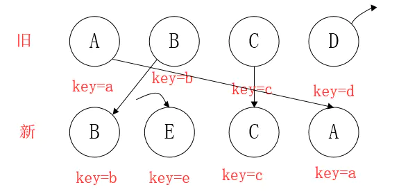

# 浏览器渲染机制

---



1. 创建 DOM tree(通过HTML解析器解析HTML， 构建DOM树)
2. 创建 Style Rules(解析css文件以及inline样式，构建样式表)
3. 构建 Render tree(将DOM树和样式表结合,每个DOM节点都有attach方法，接受样式信息，返回一个render对象
4. 布局 Layout(浏览器为每个Render tree确定一个精确的坐标位置)
5. 绘制 Painting(浏览器通过每个DOM节点的paint方法渲染出来)


- **重绘**
- **重排(回流)**

```typescript
// 方法一
div.style.left = div.offsetLeft + 1 + 'px';
div.style.top = div.offsetTop + 1 + 'px';
div.style.right = div.offsetRight + 1 + 'px';
div.style.bottom = div.offsetBottom + 1 + 'px';

// 方法二
var curLeft = div.offsetLeft;
var curTop = div.offsetTop;
var curRight = div.offsetRight;
var curBottom = div.offsetBottom;

div.style.left = curLeft + 1 + 'px';
div.style.top = curTop + 1 + 'px';
div.style.right = curRight + 1 + 'px';
div.style.bottom = curBottom + 1 + 'px';
```

- **弊端**
  - 如果需要更新10个dom节点，当浏览器收到更新节点的通知就会立即执行，因为浏览器不知道后续还有9个操作需要执行，而每个dom节点上都存在非常多的属性，多次执行dom操作则会引起性能问题

# 虚拟DOM

---

本质上就是在Js对象，在Js中够构建dom操作的必要数据的缓存


React Diff 算法介绍

##### 1、平层比较

- 虚拟DOM树全比较时间复杂度O(n^3)
- React Diff算法时间复杂度O(n)



##### 情形一

###### React Diff 中只有进行平层比较，对于跨层级的操作只有创建和删除操作



- 第一步创建D下面的A节点
- 第二步创建B节点
- 第三步创建C节点
- 第四步删除原A节点以及子节点

#### 情形二



- index<lastIndex 移动
- lastIndex=Max(index, lastIndex)


- B: index=1  lastIndex=0; 不满足index<lastIndex, B不动, lastIndex=1
- A: index=0  lastIndex=1; 满足index<lastIndex, A移动，lastIndex=1
- D: index=3  lastIndex=1; 不满足index<lastIndex, D不动， lastIndex=3
- C: index=2  lastIndex=3; 满足index<lastIndex, C移动

#### 情形三



- index<lastIndex 移动
- lastIndex=Max(index, lastIndex)


- B: index=1 lastIndex=0; 不满足index<lastIndex, B不动， lastIndex=1
- E: 不存在， E创建
- C: index=2 lastIndex=1; 不满足index<lastIndex, C不动， lastIndex=2
- A: index=0 lastIndex=2; 满足index<lastIndex, A移动， lastIndex=2
- 新集合遍历完，对旧集合遍历发现在新集合中不存节点D， 对D做删除操作

#### 情形四


- index<lastIndex 移动
- lastIndex=Max(index, lastIndex)

- D: index=3 lastIndex=0; 不满足index<lastIndex, D不动， lastIndex=3
- A: index=0 lastIndex=3; index<lastIndex, A移动, lastIndex=3
- B: index=1 lastIndex=3; index<lastIndex, B移动, lastIndex=3
- C: index=2 lastIndex=3; index<lastIndex, C移动, lastIndex=3
